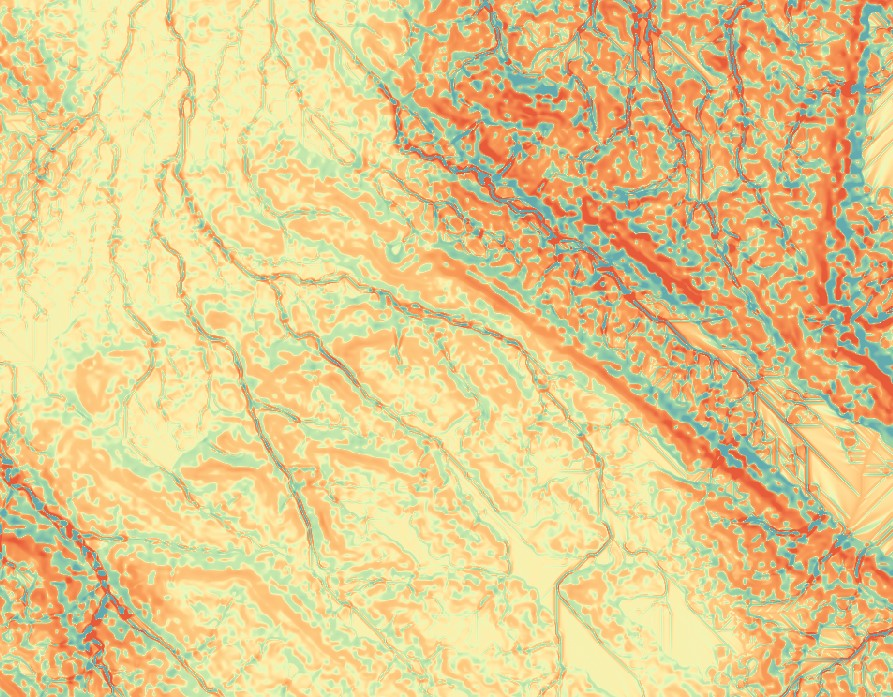

# Erosion Flow
 
A QGIS plugin providing processing algorithms calculating length-slope area,
RUSLE (Revised Universal Soil Loss Equation),
and USPED (Unit Stream Power Based Erosion/Deposition model)
for erosion analysis on DEMs (digital elevation models)

begin                : 2023-03-28
copyright            : (C) 2023 by Michael Tuck
email                : contact@michaeltuck.com
MIT LICENCE

### Installation
Put this folder in your QGIS plugins folder, restart QGIS if needed, enable from the "Manage and Install Plugins" dialog
Adds processing tools in both the Processing Toolbox and as icons on the toolbar
Plugins folder on Windows is typically found in:

WINDOWSDRIVE :\Users\YOURUSERNAME\AppData\Roaming\QGIS\QGIS3\profiles\default\python\plugins

### Example output
Using USPED, styled with red for erosion and blue for deposition

### I/O

Requied input: DEM with filled sinks
Optional inputs (as single values or rasters):
 - rainfall intensity factor (R)
 - erodibility factor (K)
 - land cover factor (C)

Processing Options: Length-slope factor (LS), RUSLE, USPED

### Factors for RUSLE and USPED

RUSLE model uses the upslope contributing area equation for LS from Moore and Burch (1986).
USPED model follows the Mitasova et al. implementation here: http://fatra.cnr.ncsu.edu/~hmitaso/gmslab/denix/usped.html

RUSLE and USPED use the same factors. Default values may be
used for soil, rainfall and cover factors in RUSLE AND USPED,
though aquiring or calculating real raster data is highly recommended for accurate results.

Units Note: Make sure to use factors with matching American (imperial) or SI (metric) units,
map units should be set to either ft or m respectively.

See this review, https://hess.copernicus.org/articles/22/6059/2018/hess-22-6059-2018.pdf
of RUSLE for more information on converting soils maps to K factor,
or alternatively look up local government tables of RUSLE factors, such as
from the Canadian government here: https://sis.agr.gc.ca/cansis/publications/manuals/2002-92/rusle-can.pdf

For basic approximated R factor, download the global set from
https://esdac.jrc.ec.europa.eu/content/global-rainfall-erosivity

For small areas the C factor may be drawn in with values
entered following the tables in the review above. C factor can
also be very roughly estimated from NDVI data.

This implementation does not include the prevention measures factor P.
If wishing to adjust for prevention measures in RUSLE, process C * P
first and input as the land cover factor C.

NOTE: All factor rasters must be scaled to the same dimension as
the DEM to avoid raster calculation errors.
